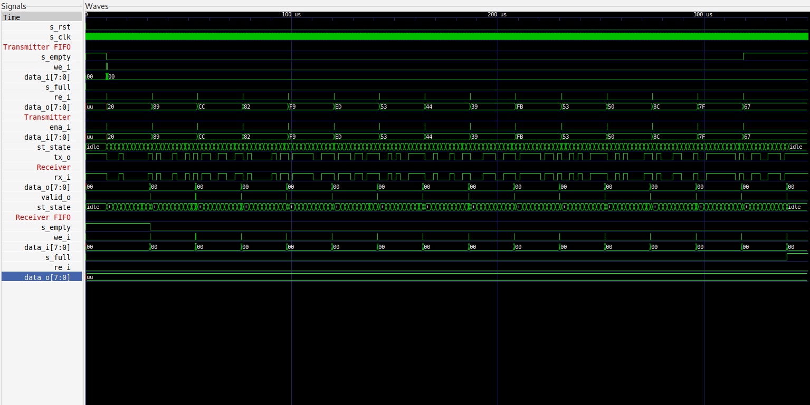

# uart

UART implementation in VHDL.

## Description

This Repository contains a VHDL implementation of an *U*niversal *A*synchronous *R*eceiver/*T*ransmitter.

## Utilization

Currently following hardware resources were used (on the alchitry AU FPGA Board):

|        Site Type        | Used | Fixed | Available |     % |
| ----------------------- |----- | ----- | --------- | ----- |
| Slice LUTs              |   56 |     0 |     20800 |  0.27 |
|   LUT as Logic          |   56 |     0 |     20800 |  0.27 |
|   LUT as Memory         |    0 |     0 |      9600 |  0.00 |
| Slice Registers         |   56 |     0 |     41600 |  0.13 |
|   Register as Flip Flop |   56 |     0 |     41600 |  0.13 |
|   Register as Latch     |    0 |     0 |     41600 |  0.00 |
| F7 Muxes                |   14 |     0 |     16300 |  0.09 |
| F8 Muxes                |    7 |     0 |      8150 |  0.09 |

